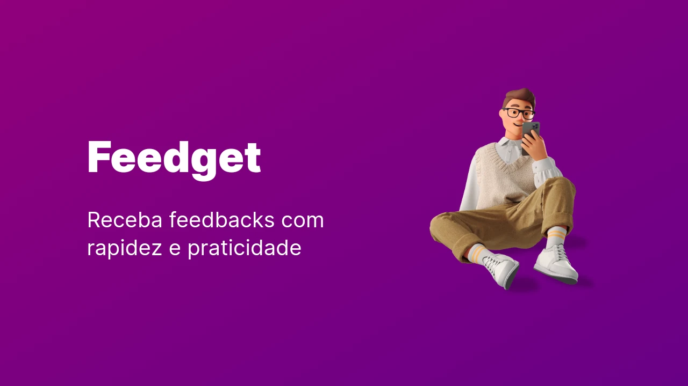
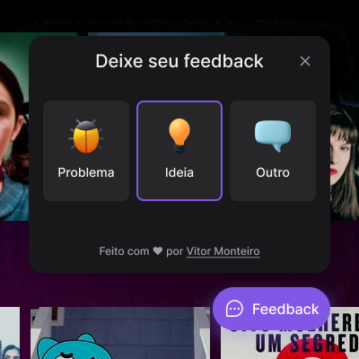

# Feedget

Feedget é um utilitário criado para ser integrado em qualquer página ou aplicação da web.
Foi proposto durante o evento Next Level Week da Rocketseat e construído a partir do zero.

Este repositório contém a versão Web criada utilizando ReactJS. Ainda existem o [Feedget Mobile](https://github.com/mluizvitor/feedget-mobile) e [Feedget Server](https://github.com/mluizvitor/feedget-server), aplicação mobile e backend, respectivamente.



## Diferenças

O projeto original foi feito durante as aulas do evento NLW Return. A versão Web consistia em ciar apenas o botão de feedback, seu formulário e navegação interna do widget e nada a mais.

Após isso, adicionei novidades, são elas:
* Primeiramente desenvolvi a interface do protótipo (no Figma) que me foi entregue. Adicionei uma barra superior e alguns conteúdos vazios para preencher espaço no restante da aplicação.
* Após isso, implementei tema claro e escuro que persiste na atualização e fechamento de página.
* Finalmente extendi o protótipo para criar uma Landing Page e a desenvolvi para apresentar o projeto com mais profissionalismo.

## Executando

Este repositório está online em formato de Landing Page e pode ser acessado em: [https://feedget.mvitor.dev/](https://feedget.mvitor.dev/)


Você também pode clonar o repositório e rodar localmente. Use o npm ou yarn

```sh
npm install
```

Antes de iniciar, é preciso criar uma variável ambiente contendo o endereço do servidor.

```
VITE_API_URL
```

Como por exemplo `VITE_API_URL=http://localhost:3333`.

Após essas configurações você pode iniciar com:

```sh
npm run dev
```

